# Opal Smiles Dental Clinic Portal - Frontend Functionality and Tech Stack Audit

## 1. Project Overview

Opal Smiles Dental Clinic Portal is a frontend web application for managing dental clinic workflows. This document audits only the code that exists in the current frontend folder.

This repository contains:

- React application shell
- Route and permission guards
- Layout and navigation
- UI components
- Feature pages
- Feature forms and dialogs
- Frontend hooks
- Frontend state management
- Frontend validation schemas
- Tenant configuration
- Frontend service-client utilities
- Demo/mock data

This document is limited to the current frontend workspace and intentionally covers only screens, components, hooks, routes, UI state, validation, configuration, and client-side utilities.

## 2. Frontend Tech Stack

### Languages

- TypeScript
- JavaScript
- HTML
- CSS
- JSON

### Framework and Build

- React 18
- Vite
- TypeScript
- React Router DOM

### UI and Styling

- Tailwind CSS
- Custom UI component primitives
- shadcn-style component structure
- Lucide React icons
- Framer Motion
- Motion
- CSS modules in selected areas

### Frontend State Management

- React Context
- TanStack Query
- Local React state
- Browser storage through custom auth storage utility

Context providers:

- `AuthProvider`
- `AppProvider`
- `TenantProvider`
- `ModalProvider`

### Data Fetching and Service Utilities

- Axios
- Generic frontend query hook
- Generic frontend mutation hook
- Response parser utility
- Token refresh utility inside the frontend service client
- Tenant header injection inside the frontend service client
- File URL helper

Important files:

- `src/services/apiClient.ts`
- `src/services/api.ts`
- `src/services/parseApiResponse.ts`
- `src/hooks/useApiQuery.ts`
- `src/hooks/useApiMutation.ts`

Note: these files are frontend service-client utilities used by the React app.

### Forms and Validation

- React Hook Form
- Zod
- JSON-based form configuration

Schema files:

- `src/lib/schemas/login.schema.ts`
- `src/lib/schemas/patient.schema.ts`
- `src/lib/schemas/appointment.schema.ts`
- `src/lib/schemas/staff.schema.ts`
- `src/lib/schemas/inventory.schema.ts`
- `src/lib/schemas/billing.schema.ts`
- `src/lib/schemas/treatment.schema.ts`
- `src/lib/schemas/emr.schema.ts`

Form config files:

- `src/config/forms/appointment.json`
- `src/config/forms/corporate.json`
- `src/config/forms/employee.json`
- `src/config/forms/emr.json`
- `src/config/forms/inventory.json`
- `src/config/forms/invoice.json`
- `src/config/forms/restock.json`
- `src/config/forms/staff.json`

### Export, Documents, and Files

- `xlsx`
- `jspdf`
- `html2canvas`
- Custom PDF/export utilities
- File URL transformation utility

Important files:

- `src/utils/exportPatient.ts`
- `src/utils/pdfGenerator.ts`

### Digital Signature

- `react-signature-canvas`
- Signature pad UI for consent forms

Important file:

- `src/components/Consent/SignaturePad.tsx`

### Notifications and Feedback

- Custom toast wrapper
- Confirmation modal
- Loading states
- Error states
- Offline detector

### Development Tooling

Scripts:

- `npm run dev`
- `npm run build`
- `npm run lint`
- `npm run preview`

Configured:

- ESLint
- TypeScript ESLint
- React Hooks linting
- React Refresh linting

Not configured in this folder:

- Automated test runner
- Playwright
- React Testing Library
- Prettier config
- CI/CD config

## 3. Frontend Architecture

### Application Shell

The root app composes global providers and routes.

Important files:

- `src/App.tsx`
- `src/main.tsx`

Global wrappers:

- `QueryClientProvider`
- `TenantProvider`
- `AuthProvider`
- `AppProvider`
- `ModalProvider`
- `BrowserRouter`
- `Toaster`
- `OfflineDetector`

### Routing

The application defines these frontend routes:

- `/login`
- `/dashboard`
- `/appointments`
- `/patients`
- `/patient-queue`
- `/treatments`
- `/billing`
- `/staff`
- `/profit-sharing`
- `/emr`
- `/consent`
- `/reports`
- `/inventory`
- `/membership`

Route protection is implemented in `src/App.tsx`.

### Layout

Layout components:

- `MainLayout`
- `Sidebar`
- `Header`
- `MobileNav`
- `GlobalSearch`
- `PatientDetailsModal`
- `ModalRegistry`

Important folder:

- `src/components/Layout`

### Tenant Configuration

Tenant configuration controls branding, sidebar grouping, feature flags, enabled screens, labels, support info, currency, timezone, and date format.

Important files:

- `src/config/tenants/default.json`
- `src/config/tenants/basic-clinic.json`
- `src/config/tenants/corporate-clinic.json`
- `src/contexts/TenantContext.tsx`

Tenant-controlled frontend screens:

- Dashboard
- Appointments
- Patients
- Consultation
- Treatments
- Medical Records
- Consent Forms
- Billing
- Inventory
- Analytics
- Staff
- Profit Sharing
- Memberships

### Frontend Caching Strategy

TanStack Query defaults:

- `staleTime`: 5 minutes
- `retry`: 1
- `refetchOnWindowFocus`: false
- `refetchOnMount`: false
- `retryOnMount`: false

Feature hooks invalidate relevant frontend query keys after mutations.

### Modal Architecture

The app uses a central modal registry for feature dialogs.

Important files:

- `src/contexts/ModalContext.tsx`
- `src/components/Layout/ModalRegistry.tsx`

Modal examples:

- Appointment form
- Patient form
- Invoice form
- Invoice viewer
- Treatment form
- Treatment viewer
- Treatment session manager
- Doctor form
- Doctor schedule manager
- Salary payment
- Salary history
- EMR form
- EMR viewer
- Consent form
- Consent viewer
- Inventory forms
- Inventory history
- Quick registration
- Employee form
- Confirmation modal

## 4. Feature Functionality Audit

## 4.1 Authentication and Authorization UI

### Description

The frontend supports login, logout, demo login, route protection, permission parsing, and permission-based sidebar visibility.

### Business Purpose

Controls which frontend modules a user can access after login.

### User Flow

1. User opens the app.
2. If not authenticated, user is routed to login.
3. User enters email and password.
4. On successful login, auth state and tokens are stored by frontend utilities.
5. User is redirected to the first permitted screen.
6. Sidebar shows only allowed screens.
7. Logout clears stored frontend auth state.

### Flow Diagram

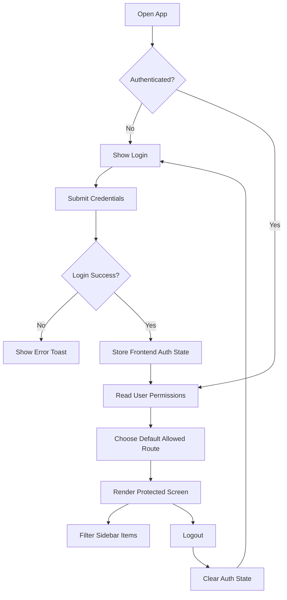

### Frontend Files

- `src/App.tsx`
- `src/contexts/AuthContext.tsx`
- `src/auth/authStorage.ts`
- `src/utils/permission.ts`
- `src/components/Auth/LoginForm.tsx`
- `src/components/Auth/Views/LoginView.tsx`
- `src/components/Auth/Views/ForgotView.tsx`
- `src/components/Auth/Views/ForgotSentView.tsx`

### Implemented Functionality

- Login form
- Demo login mode
- Logout
- Auth state initialization from storage
- Permission parsing
- Protected routes
- Default route redirect based on permissions
- Sidebar filtering
- Toast feedback
- Token refresh handling in frontend service client

### Validation

- Email required
- Email format
- Password required

### Roles and Permissions Used by Frontend

Roles:

- superadmin
- admin
- doctor
- receptionist
- assistant
- nurse
- staff

Permissions:

- ALL
- DASHBOARD
- APPOINTMENT
- APPOINTMENTS
- PATIENTS
- CONSULTATION
- TREATMENTS
- MEDICAL_RECORDS
- CONSENT_FORMS
- BILLING
- INVENTORY
- ANALYTICS
- REPORTS
- STAFF
- STAFF_MANAGEMENT
- PROFIT_SHARING
- CORPORATE_PLANS
- MEMBERSHIP

### Missing Frontend Functionality

- Complete forgot password form flow
- Remember-me checkbox
- Session expiry warning
- Profile/security settings page
- MFA UI
- SSO login button UI
- Login history UI

### AI Opportunities

- User permission setup assistant
- Suspicious login warning UI
- Role-based onboarding assistant

## 4.2 Dashboard

### Description

Dashboard provides a front-office overview with stats, appointments, alerts, recent patients, and doctor performance widgets.

### Business Purpose

Gives users a quick operational snapshot of the clinic.

### User Flow

1. User opens Dashboard.
2. User sees greeting and current date.
3. User reviews stats and widgets.
4. User can open Add New Patient modal.

### Flow Diagram

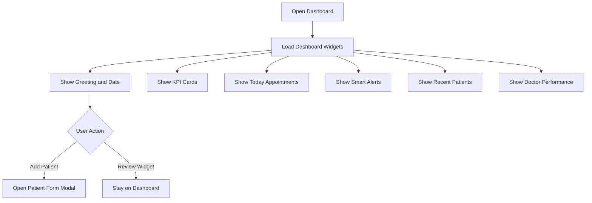

### Frontend Files

- `src/pages/DashboardPage.tsx`
- `src/components/Dashboard/DashboardStats.tsx`
- `src/components/Dashboard/TodayAppointments.tsx`
- `src/components/Dashboard/RecentPatients.tsx`
- `src/components/Dashboard/SmartAlerts.tsx`
- `src/components/Dashboard/DashboardWidgets.tsx`
- `src/components/Dashboard/Charts.tsx`

### Implemented Functionality

- Time-based greeting
- Current date display
- Dashboard stat cards
- Revenue/chart display components
- Today appointments section
- Recent patients section
- Smart alerts
- Appointment status widget
- Doctor performance widget
- Quick Add Patient action

### State Management

- `useAppData`
- TanStack Query-backed hooks
- Local derived component data

### Missing Frontend Functionality

- Date range selector
- Widget customization
- Dashboard export
- Role-specific dashboard layout
- Drag-and-drop widgets
- Dashboard preferences
- Detailed drill-down UI

### AI Opportunities

- Daily clinic summary widget
- Smart alert prioritization
- Revenue insight cards

## 4.3 Appointments

### Description

Appointments feature provides calendar and list views, appointment forms, doctor booking, check-in flow, no-show handling, and appointment stats.

### Business Purpose

Helps clinic staff schedule and manage patient visits.

### User Flow

1. User opens Appointments.
2. User switches between calendar and list views.
3. User filters by doctor, date, search text, or status.
4. User creates or edits appointment.
5. User checks in patient.
6. If patient exists, patient verification flow opens.
7. If patient is not found, patient registration flow opens.

### Flow Diagram

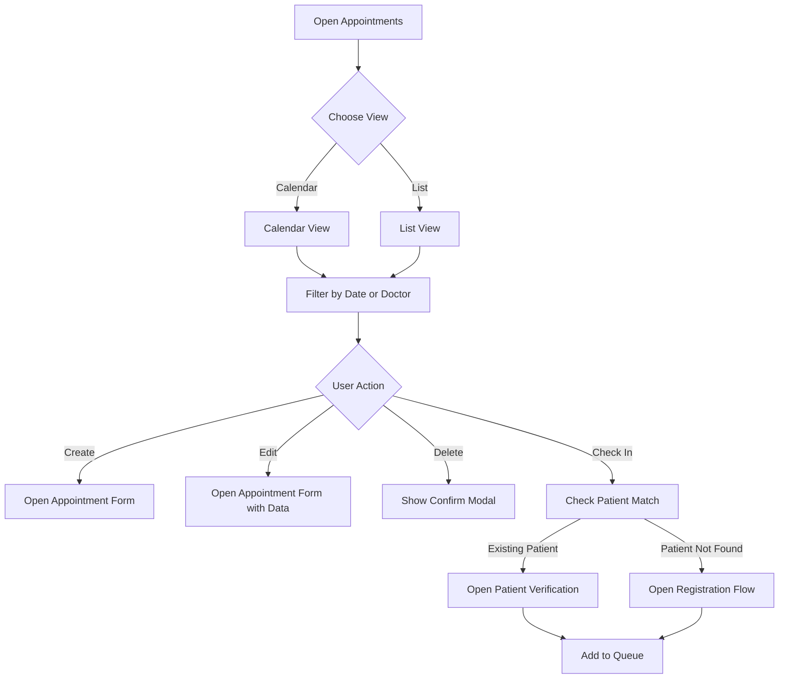

### Frontend Files

- `src/pages/AppointmentsPage.tsx`
- `src/components/Appointments/AppointmentCalendar.tsx`
- `src/components/Appointments/AppointmentList.tsx`
- `src/components/Appointments/AppointmentForm.tsx`
- `src/components/Appointments/DoctorBooking.tsx`
- `src/components/Appointments/TodaySchedulePopup.tsx`
- `src/components/Appointments/AppointmentList/AppointmentStats.tsx`
- `src/components/Appointments/AppointmentList/AppointmentTableRow.tsx`
- `src/components/Appointments/AppointmentList/AppointmentActionMenu.tsx`
- `src/components/Appointments/AppointmentForm/PatientInfoFields.tsx`
- `src/components/Appointments/AppointmentForm/ScheduleFields.tsx`
- `src/components/Appointments/AppointmentForm/TreatmentFields.tsx`
- `src/components/Appointments/AppointmentCalendar/CalendarGrid.tsx`
- `src/components/Appointments/AppointmentCalendar/DayAgenda.tsx`
- `src/components/Appointments/AppointmentCalendar/DoctorSidebar.tsx`
- `src/components/Appointments/AppointmentCalendar/BookingSlots.tsx`

### Hooks

- `useAppointmentData`
- `useAppointmentsListQuery`
- `useAppointmentQuery`
- `useAppointmentCalendarQuery`
- `useAvailableSlotsQuery`
- `useCreateAppointmentMutation`
- `useUpdateAppointmentMutation`
- `useDeleteAppointmentMutation`
- `useCheckInAppointmentMutation`
- `useCheckInAfterRegistrationMutation`
- `useMarkNoShowMutation`
- `useRestoreAppointmentStatusMutation`
- `useAppointmentStatsQueries`
- `useScheduleQueries`

### Implemented Functionality

- Appointment calendar
- Appointment list
- Appointment stats
- Create appointment
- Edit appointment
- Delete appointment
- Doctor booking
- Doctor/date filtering
- Search
- No-show handling
- Status restore
- Patient check-in
- Patient registration handoff
- Queue handoff
- Today schedule popup
- Available slot UI support

### Validation

- Patient name required
- Phone required
- Doctor required
- Date required
- Time required
- Appointment type enum

### Missing Frontend Functionality

- Recurring appointment UI
- Waitlist UI
- Cancellation reason modal
- Reschedule reason modal
- Calendar sync UI
- Reminder setup UI
- Chair/resource selector
- Slot conflict warning UI

### AI Opportunities

- Natural-language appointment creation
- Suggested appointment slot
- No-show risk indicator in list/calendar

## 4.4 Patients

### Description

Patients feature manages patient lists, registration form, patient profile details, medical history, family/corporate relationships, documents, prescriptions, appointment history, and export.

### Business Purpose

Acts as the main patient registry and patient profile workspace.

### User Flow

1. User opens Patients.
2. User searches or filters the patient list.
3. User creates a patient using a multi-step form.
4. User opens patient details.
5. User reviews overview, history, prescriptions, plan coverage, documents, and related data.
6. User can export patient report.

### Flow Diagram

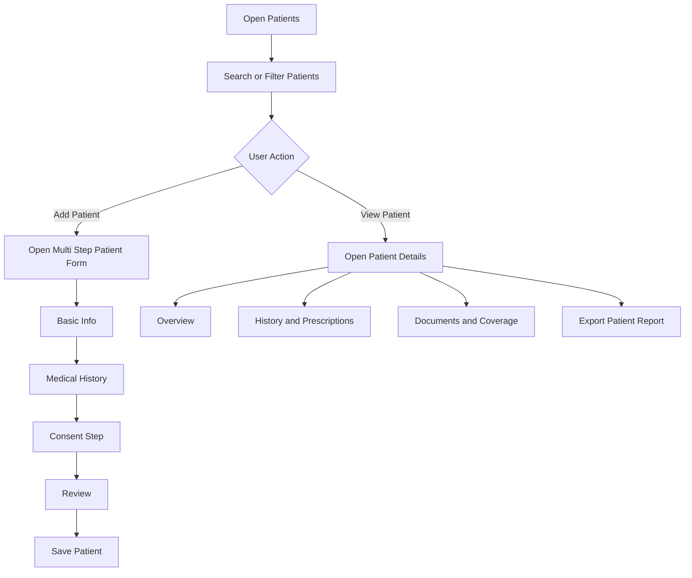

### Frontend Files

- `src/pages/PatientsPage.tsx`
- `src/components/Patients/PatientList.tsx`
- `src/components/Patients/PatientList/PatientTable.tsx`
- `src/components/Patients/PatientList/PatientCard.tsx`
- `src/components/Patients/PatientList/PatientFilters.tsx`
- `src/components/Patients/PatientList/PatientStats.tsx`
- `src/components/Patients/PatientForm.tsx`
- `src/components/Patients/PatientForm/Step1BasicInfo.tsx`
- `src/components/Patients/PatientForm/Step2MedicalHistory.tsx`
- `src/components/Patients/PatientForm/Step3Consent.tsx`
- `src/components/Patients/PatientForm/Step4Review.tsx`
- `src/components/Patients/PatientDetails.tsx`
- `src/components/Patients/PatientDetails/OverviewTab.tsx`
- `src/components/Patients/PatientDetails/TabComponents.tsx`
- `src/components/Patients/PatientDetails/PlanCoverageCard.tsx`
- `src/components/Patients/PatientDetails/PrescriptionPrintModal.tsx`
- `src/components/Patients/PatientDetails/PrintTemplates.ts`

### Hooks

- `usePatientData`
- `usePatientQuery`
- `usePatientDetailQuery`
- `useCreatePatientMutation`
- `useUpdatePatientMutation`
- `useDeletePatientMutation`
- `useUpdatePatientStatusMutation`
- `usePatientPhoneExistsQuery`
- `usePatientTotalQuery`
- `usePatientActiveQuery`
- `usePatientNewQuery`
- `usePatientOutstandingQuery`
- `usePatientDocumentsQuery`
- `usePatientFamilyTreeQuery`
- `usePatientAppointmentHistoryQuery`
- `usePatientPrescriptionsQuery`
- `useCheckEmployeeQuery`
- `useMedicalHistoriesQuery`
- `useAllergiesQuery`
- `useMedicinesQuery`

### Implemented Functionality

- Patient list
- Table and card displays
- Search and filters
- Patient stats
- Patient create/edit form
- Multi-step registration
- Basic information
- Emergency details
- Medical history
- Past dental history
- Allergy details
- Previous doctor/clinic details
- Consent step
- Review step
- Patient details modal/page
- Family tree data display support
- Appointment history support
- Prescription history support
- Document display support
- Plan coverage card
- Patient export/print utilities
- Duplicate phone check support
- Corporate member check support

### Validation

- Name minimum length
- Email format
- Phone length
- Gender enum
- Blood group enum
- Marital status enum

### Missing Frontend Functionality

- Duplicate merge screen
- Patient portal UI
- Advanced saved filters
- Activity timeline
- Comments
- Mentions
- Offline registration flow
- Attachment upload manager
- Bulk import UI hardening
- Patient communication log

### AI Opportunities

- Patient summary panel
- OCR for patient documents
- Smart patient search
- Risk factor extraction

## 4.5 Consultation and Patient Queue

### Description

Consultation feature supports doctor-facing queue, clinical encounter form, tooth chart, diagnosis, treatment planning, prescriptions, clinical images, previous consultation review, and follow-up scheduling.

### Business Purpose

Supports the clinical workflow during patient consultation.

### User Flow

1. Patient enters queue.
2. Doctor selects patient.
3. Doctor reviews previous consultations.
4. Doctor records tooth findings, observations, diagnosis, prescriptions, treatment plan, images, and follow-up.
5. Doctor completes consultation.

### Flow Diagram

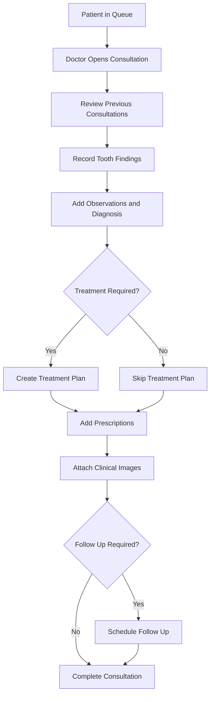

### Frontend Files

- `src/pages/ConsultationPage.tsx`
- `src/components/Doctor/PatientQueue.tsx`
- `src/components/Doctor/PatientQueue/QueueCard.tsx`
- `src/components/Doctor/PatientConsultation.tsx`
- `src/components/Doctor/ToothChart.tsx`
- `src/components/Doctor/DoctorCheckIn.tsx`
- `src/components/Doctor/DirectConsultationPopup.tsx`
- `src/components/Doctor/PatientConsultation/ConsultationHeader.tsx`
- `src/components/Doctor/PatientConsultation/ObservationsAndToothChart.tsx`
- `src/components/Doctor/PatientConsultation/TreatmentPlanning.tsx`
- `src/components/Doctor/PatientConsultation/PrescriptionForm.tsx`
- `src/components/Doctor/PatientConsultation/ClinicalImages.tsx`
- `src/components/Doctor/PatientConsultation/AdditionalNotes.tsx`
- `src/components/Doctor/PatientConsultation/FollowUpScheduler.tsx`
- `src/components/Doctor/PatientConsultation/PreviousConsultationsView.tsx`
- `src/components/Doctor/PatientConsultation/CompletionView.tsx`

### Hooks

- `useConsultationsQuery`
- `useConsultationQuery`
- `usePatientConsultationsQuery`
- `useCreateConsultationMutation`
- `useUpdateConsultationMutation`
- `useDeleteConsultationMutation`
- `useCompleteConsultationMutation`

### Implemented Functionality

- Patient queue
- Queue cards
- Direct consultation popup
- Tooth chart
- Tooth condition mapping
- Clinical observations
- Diagnosis notes
- Treatment plan creation UI
- Prescription rows
- Clinical images section
- X-ray/lab file placeholders
- Additional notes
- Follow-up scheduler
- Previous consultation viewer
- Completion view
- Draft consultation state in modal context

### Missing Frontend Functionality

- Autosave indicator
- Clinical templates
- Encounter lock/finalize UI
- Medication safety warnings
- Doctor signature UI
- Timeline comparison view
- Keyboard-first consultation workflow

### AI Opportunities

- Consultation note summary
- Suggested treatment plan
- Suggested prescription checks
- Natural-language clinical note entry

## 4.6 Treatments

### Description

Treatments feature manages treatment plans, treatment status, sessions, prescriptions, images, and viewer/detail workflows.

### Business Purpose

Tracks planned and ongoing dental procedures.

### User Flow

1. User opens Treatments.
2. User views treatment list and stats.
3. User creates or edits treatment.
4. User manages sessions.
5. User starts treatment or marks completed.
6. User views treatment details.

### Flow Diagram

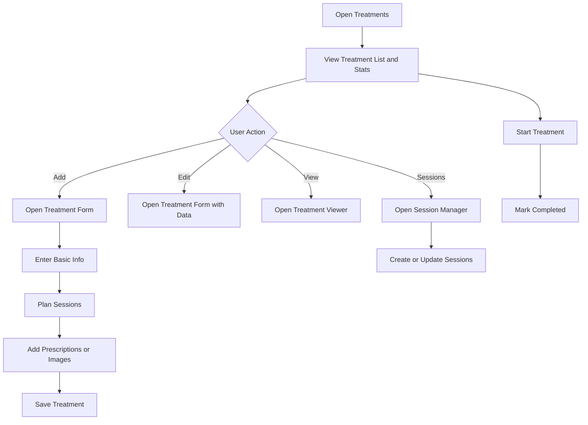

### Frontend Files

- `src/pages/TreatmentsPage.tsx`
- `src/components/Treatments/TreatmentList.tsx`
- `src/components/Treatments/TreatmentList/TreatmentTableRow.tsx`
- `src/components/Treatments/TreatmentList/TreatmentStats.tsx`
- `src/components/Treatments/TreatmentForm.tsx`
- `src/components/Treatments/TreatmentForm/BasicInfoSection.tsx`
- `src/components/Treatments/TreatmentForm/SessionPlannerSection.tsx`
- `src/components/Treatments/TreatmentForm/PrescriptionSection.tsx`
- `src/components/Treatments/TreatmentForm/ImageUploadSection.tsx`
- `src/components/Treatments/TreatmentViewer.tsx`
- `src/components/Treatments/TreatmentSessionManager.tsx`

### Hooks

- `useTreatmentData`
- `useTreatmentPlansQuery`
- `useTreatmentPlanQuery`
- `useTreatmentPlanStatsQuery`
- `useCreateTreatmentPlanMutation`
- `useUpdateTreatmentPlanMutation`
- `useUpdateTreatmentPlanStatusMutation`
- `useMarkTreatmentPlanDoneMutation`
- `useTreatmentSessionHooks`
- `useTreatmentForm`

### Implemented Functionality

- Treatment list
- Treatment stats
- Add treatment
- Edit treatment
- View treatment
- Start treatment
- Mark completed/done
- Manage sessions
- Session planner
- Prescription section
- Image upload section
- Status tracking

### Validation

- Patient name required
- Procedure required
- Date required
- Status enum
- Sessions array
- Prescriptions array

### Missing Frontend Functionality

- Treatment templates
- Version history UI
- Treatment approval UI
- Treatment estimate PDF UI
- Consent linkage UI
- Procedure price catalog UI

### AI Opportunities

- Treatment recommendation assistant
- Treatment cost explanation
- Treatment progress summary

## 4.7 Billing

### Description

Billing feature manages invoice list, invoice form, invoice viewer, payment modal, payment history modal, pending items, plan banner, discounts, GST-related fields, and complimentary notes.

### Business Purpose

Supports front-office billing and payment workflows.

### User Flow

1. User opens Billing.
2. User views invoices and billing stats.
3. User creates invoice.
4. User selects patient and items.
5. User reviews plan coverage.
6. User saves invoice.
7. User views invoice.
8. User records payment or views payment history.

### Flow Diagram

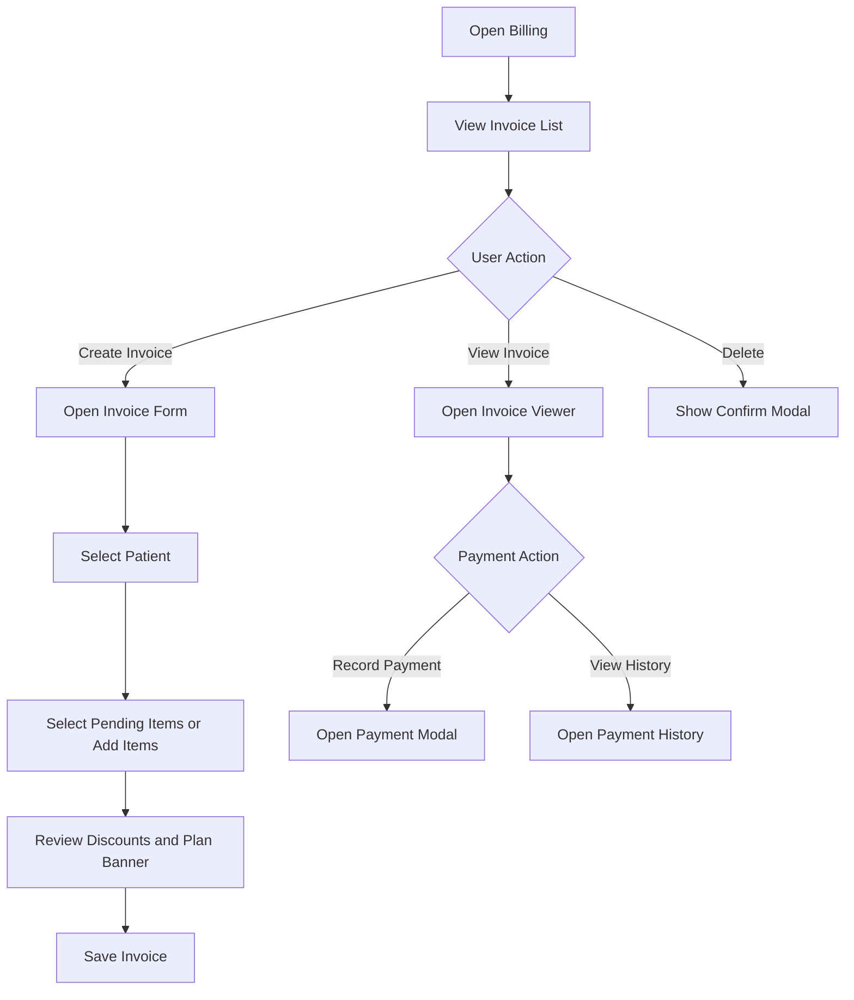

### Frontend Files

- `src/pages/BillingPage.tsx`
- `src/components/Billing/InvoiceList.tsx`
- `src/components/Billing/InvoiceForm.tsx`
- `src/components/Billing/InvoiceViewer.tsx`
- `src/components/Billing/InvoicePaymentModal.tsx`
- `src/components/Billing/PaymentHistoryModal.tsx`
- `src/components/Billing/InvoiceForm/InvoiceItemRow.tsx`
- `src/components/Billing/InvoiceForm/PendingItems.tsx`
- `src/components/Billing/InvoiceForm/PlanBanner.tsx`

### Hooks

- `useInvoiceData`
- `useInvoicesQuery`
- `useInvoiceQuery`
- `useInvoiceStatsQuery`
- `useCreateInvoiceMutation`
- `useDeleteInvoiceMutation`
- `usePayInvoiceMutation`
- `usePaymentHistoryQuery`
- `useUnbilledItemsQuery`

### Implemented Functionality

- Invoice list
- Invoice form
- Invoice item rows
- Pending item selection
- Plan banner
- Invoice viewer
- Payment modal
- Payment history modal
- Invoice stats support
- Mark paid support
- Delete invoice support
- Complimentary note support
- Linked item support

### Validation

- Patient name required
- Date required
- At least one invoice item required
- Item description required

### Missing Frontend Functionality

- Refund UI
- Credit note UI
- Payment gateway UI
- Receipt template UI
- Invoice number settings UI
- Accounting export UI
- Aging report UI

### AI Opportunities

- Billing anomaly indicator
- Suggested pending items
- Collection priority assistant

## 4.8 Medical Records / EMR

### Description

Medical Records feature displays grouped patient records, timelines, EMR forms, EMR viewer, search, and type filtering.

### Business Purpose

Gives clinical users a frontend workspace for reviewing patient medical history.

### User Flow

1. User opens Medical Records.
2. User searches records.
3. User filters by record type.
4. Records are grouped by patient.
5. User opens record/timeline detail.
6. User can create EMR record.

### Flow Diagram

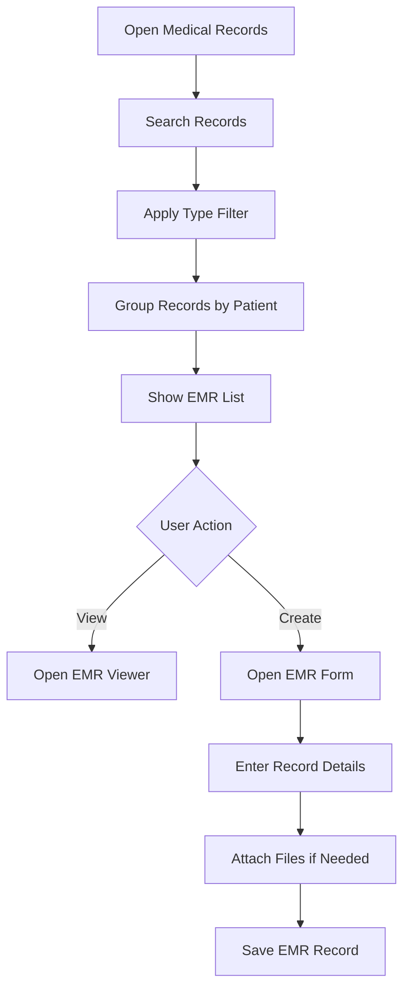

### Frontend Files

- `src/pages/MedicalRecordsPage.tsx`
- `src/components/EMR/EMRList.tsx`
- `src/components/EMR/EMRForm.tsx`
- `src/components/EMR/EMRViewer.tsx`

### Hooks

- `useEMRListQuery`
- `useEMRDetailQuery`
- `useCreateEMRMutation`

### Implemented Functionality

- EMR list
- Search
- Type filter
- Grouping by patient
- Timeline construction
- Last visit display
- Last doctor display
- Attachment display mapping
- EMR form
- EMR viewer

### Validation

- Patient required
- Record type required
- Title required
- Content required
- Date required
- Attachments array

### Missing Frontend Functionality

- Edit EMR screen
- Delete EMR screen
- Version history UI
- Doctor signing UI
- Advanced filters
- Attachment manager
- Timeline comparison UI

### AI Opportunities

- EMR summary
- Timeline highlight extraction
- Semantic record search

## 4.9 Consent Forms

### Description

Consent feature manages consent list, consent form, consent viewer, digital signatures, and offline consent image display support.

### Business Purpose

Supports collection and viewing of procedure consent from patients.

### User Flow

1. User opens Consent Forms.
2. User creates or opens consent form.
3. User fills procedure, declaration, risks, alternatives, witness, and signatures.
4. User saves and later views consent form.

### Flow Diagram

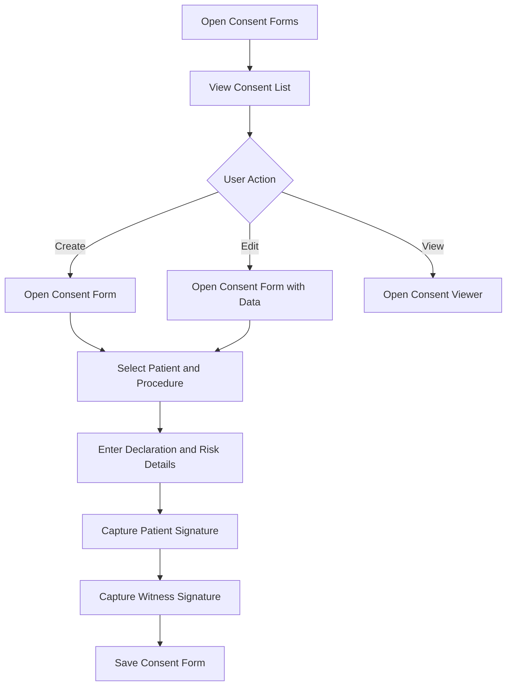

### Frontend Files

- `src/pages/ConsentPage.tsx`
- `src/components/Consent/ConsentFormList.tsx`
- `src/components/Consent/ConsentForm.tsx`
- `src/components/Consent/ConsentFormViewer.tsx`
- `src/components/Consent/SignaturePad.tsx`
- `src/constants/consent.constants.ts`

### Hooks

- `useConsentFormsQuery`
- `useConsentFormDetailQuery`
- `useCreateConsentFormMutation`
- `useUpdateConsentFormMutation`
- `useDeleteConsentFormMutation`

### Implemented Functionality

- Consent list
- Consent form
- Consent viewer
- Patient signature
- Witness signature
- Doctor display
- Treatment/procedure fields
- Risk disclosure fields
- Alternative treatment fields
- Offline consent image support

### Missing Frontend Functionality

- Consent template builder
- Template version viewer
- Multilingual consent UI
- Consent revocation UI
- Doctor signature UI
- Legal PDF preview

### AI Opportunities

- Plain-language consent explanation
- Consent translation helper

## 4.10 Inventory

### Description

Inventory feature manages item list, item forms, categories, stock summary, restock, consume, adjust, and movement history UI.

### Business Purpose

Helps front-office/admin users manage clinic stock visually from the frontend.

### User Flow

1. User opens Inventory.
2. User reviews stock list and summary.
3. User creates or edits item.
4. User restocks item.
5. User consumes item.
6. User adjusts stock.
7. User views item movement history.

### Flow Diagram

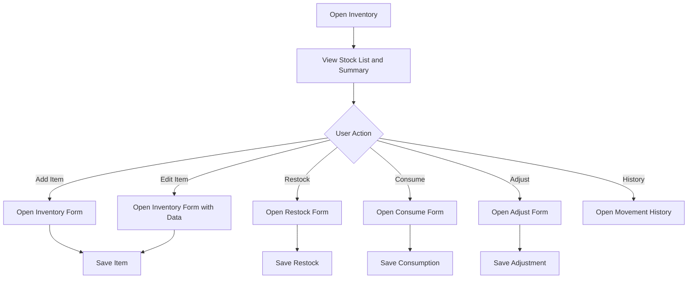

### Frontend Files

- `src/pages/InventoryPage.tsx`
- `src/components/Inventory/InventoryList.tsx`
- `src/components/Inventory/InventoryForm.tsx`
- `src/components/Inventory/RestockForm.tsx`
- `src/components/Inventory/ConsumeForm.tsx`
- `src/components/Inventory/AdjustForm.tsx`
- `src/components/Inventory/InventoryHistoryViewer.tsx`

### Hooks

- `useInventoryData`
- `useInventoryListQuery`
- `useInventoryItemQuery`
- `useInventorySummaryQuery`
- `useInventoryCategoriesQuery`
- `useInventoryMovementsQuery`
- `useCreateInventoryItemMutation`
- `useUpdateInventoryItemMutation`
- `useDeleteInventoryItemMutation`
- `useCreateInventoryCategoryMutation`
- `useUpdateInventoryCategoryMutation`
- `useDeleteInventoryCategoryMutation`
- `useRestockInventoryItemMutation`
- `useConsumeInventoryItemMutation`
- `useAdjustInventoryItemMutation`

### Implemented Functionality

- Inventory list
- Stock summary
- Item create/edit
- Category support
- Restock form
- Consume form
- Adjust form
- Movement history viewer
- Low stock threshold support
- Expiry date field
- Batch number field
- Supplier field
- Warranty field
- Unit cost field

### Validation

- Item name required
- Category required
- Unit required
- Consume reason required
- Adjust reason required

### Missing Frontend Functionality

- Barcode scanning UI
- Supplier management UI
- Purchase order UI
- Expiry alert center
- Reorder recommendation UI
- Stock transfer UI
- Inventory valuation report UI

### AI Opportunities

- Stock reorder suggestions
- Usage forecast widget
- Expiry risk alerting

## 4.11 Staff, Doctors, Schedules, and Salary

### Description

Staff feature manages doctors/staff list, role filtering, staff forms, doctor schedules, salary payment modal, salary history modal, roles, and specializations.

### Business Purpose

Helps clinic admins manage staff availability, profiles, and compensation UI.

### User Flow

1. User opens Staff.
2. User searches and filters staff by role.
3. User creates or edits staff/doctor.
4. User manages schedule.
5. User changes active status.
6. User pays salary.
7. User views salary history.

### Flow Diagram

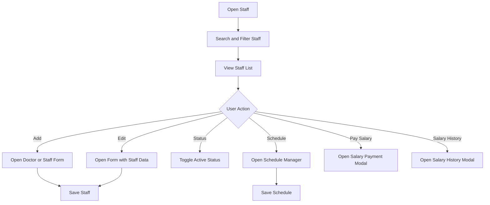

### Frontend Files

- `src/pages/StaffPage.tsx`
- `src/components/Staff/DoctorManagement.tsx`
- `src/components/Staff/DoctorForm.tsx`
- `src/components/Staff/DoctorScheduleManager.tsx`
- `src/components/Staff/SalaryPaymentModal.tsx`
- `src/components/Staff/SalaryHistoryModal.tsx`
- `src/components/Staff/StaffForm/Step1Personal.tsx`
- `src/components/Staff/StaffForm/Step2Role.tsx`
- `src/components/Staff/StaffForm/Step3Documentation.tsx`
- `src/components/Staff/StaffForm/Step4Professional.tsx`

### Hooks

- `useStaffData`
- `useStaffQuery`
- `useSingleStaffQuery`
- `useCreateStaffMutation`
- `useUpdateStaffMutation`
- `useDeleteStaffMutation`
- `useUpdateStaffStatusMutation`
- `useDoctorsListQuery`
- `useDoctorScheduleQuery`
- `useCreateDoctorScheduleMutation`
- `useSalaryHistoryQuery`
- `usePaySalaryMutation`
- `useRolesQuery`
- `useSpecializationsQuery`
- `useCreateSpecializationMutation`
- `useDeleteSpecializationMutation`

### Implemented Functionality

- Staff list
- Search
- Role filter
- Add doctor/staff
- Edit doctor/staff
- Delete staff
- Active/inactive status
- Schedule manager
- Salary payment
- Salary history
- Role list support
- Specialization support
- Multi-step staff form
- Professional details
- Documentation details

### Validation

- Name minimum length
- Email format
- Phone minimum length
- Role enum
- Password minimum length
- Confirm password field
- Profit percentage range

### Missing Frontend Functionality

- Attendance UI
- Leave management UI
- Payroll approval UI
- Credential expiry alerts
- Staff document repository
- Role permission editor
- Shift swap UI

### AI Opportunities

- Schedule optimization
- Staff workload insights
- Permission recommendation assistant

## 4.12 Membership and Corporate Plans

### Description

Membership feature manages membership plans, corporate/individual plan tabs, member list, employee/member forms, dependents, bulk import, plan change modal, and quick registration flow.

### Business Purpose

Supports frontend workflows for corporate and individual dental memberships.

### User Flow

1. User opens Membership.
2. User views plan/member stats.
3. User switches between Plans and Members.
4. User creates or edits a plan.
5. User creates or edits a member.
6. User adds dependents.
7. User bulk imports members.
8. User changes member plan.
9. User can use quick registration flow.

### Flow Diagram

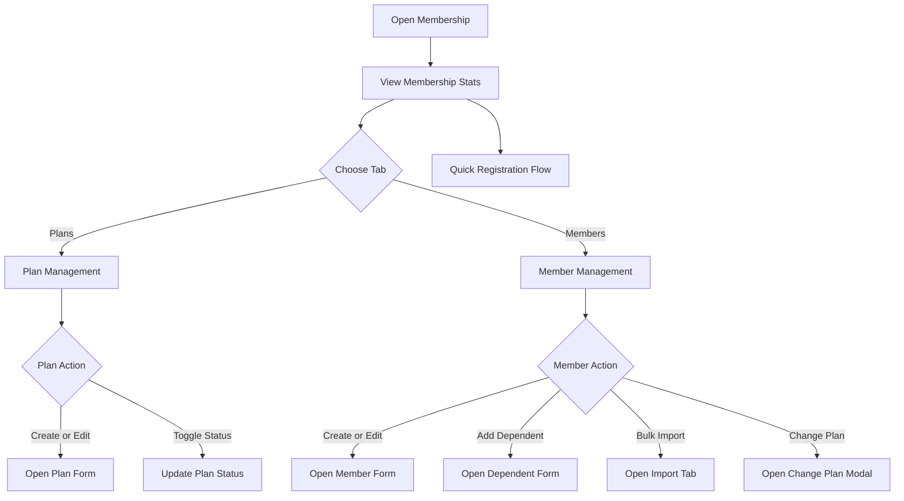

### Frontend Files

- `src/pages/CorporatePlansPage.tsx`
- `src/components/CorporatePlans/CorporatePlanManagement.tsx`
- `src/components/CorporatePlans/CorporatePlanSelector.tsx`
- `src/components/CorporatePlans/EmployeeManagement.tsx`
- `src/components/CorporatePlans/Plan/CorporatePlanCard.tsx`
- `src/components/CorporatePlans/Plan/CorporatePlanFormModal.tsx`
- `src/components/CorporatePlans/Employee/EmployeeFormModal.tsx`
- `src/components/CorporatePlans/Employee/IndividualMemberFormModal.tsx`
- `src/components/CorporatePlans/Employee/EmployeeDependentFormModal.tsx`
- `src/components/CorporatePlans/Employee/ChangePlanModal.tsx`
- `src/components/CorporatePlans/Employee/EmployeeImportTab.tsx`
- `src/components/CorporatePlans/QuickRegistration/QuickRegistrationFlow.tsx`
- `src/components/CorporatePlans/QuickRegistration/QuickRegistrationModal.tsx`

### Hooks

- `useCorporateData`
- `useCorporatePlansQuery`
- `useCorporatePlanQuery`
- `useCreateCorporatePlanMutation`
- `useUpdateCorporatePlanMutation`
- `useDeleteCorporatePlanMutation`
- `useUpdateCorporatePlanStatusMutation`
- `useMembershipStatsQuery`
- `useEmployeesQuery`
- `useEmployeeQuery`
- `useCreateEmployeeMutation`
- `useUpdateEmployeeMutation`
- `useDeleteEmployeeMutation`
- `useUpdateEmployeeStatusMutation`
- `useBulkImportEmployeeMutation`
- `useCompaniesQuery`
- `useActivePlansQuery`
- `useDependentsQuery`
- `useAddDependentMutation`
- `useUpdateDependentMutation`
- `useRemoveDependentMutation`
- `useIndividualPlansQuery`

### Implemented Functionality

- Membership stats cards
- Plans tab
- Members tab
- Plan search
- Status filter
- Category filter
- Corporate plans
- Individual plans
- Plan card
- Plan form modal
- Member list
- Member form modal
- Individual member form
- Dependent form
- Change plan modal
- Bulk import tab
- Quick registration flow
- Plan coverage-related display support

### Missing Frontend Functionality

- Member card print/download UI
- Renewal workflow UI
- Benefit usage screen
- Employer portal UI
- Plan version history UI
- Dependent approval UI
- Membership billing UI

### AI Opportunities

- Membership eligibility assistant
- Import error explanation
- Plan recommendation assistant

## 4.13 Reports and Analytics

### Description

Reports feature provides an analytics dashboard UI.

### Business Purpose

Gives clinic admins a visual reporting surface.

### User Flow

1. User opens Reports.
2. User views analytics dashboard.
3. User reviews available charts and summaries.

### Flow Diagram

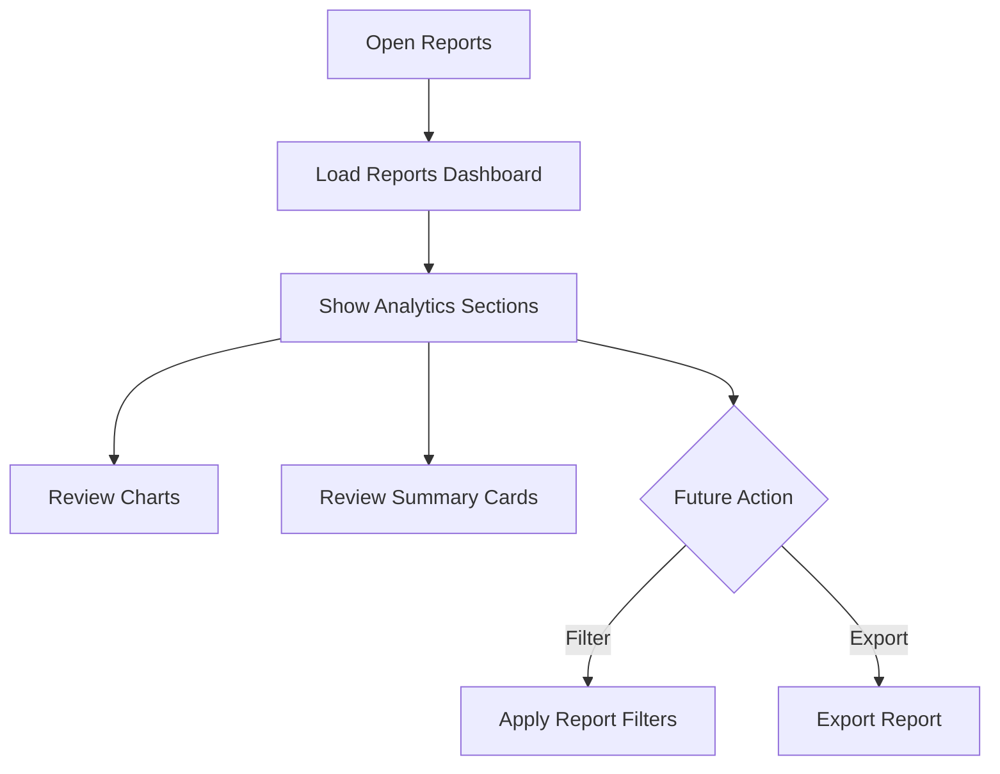

### Frontend Files

- `src/pages/ReportsPage.tsx`
- `src/components/Reports/ReportsDashboard.tsx`
- `src/data/mockAnalytics.ts`
- `clinic_analytics_dashboard_plan.md`

### Implemented Functionality

- Reports page
- Reports dashboard component
- Mock analytics data
- Tenant flags for revenue, patient, and appointment reports

### Missing Frontend Functionality

- Report builder UI
- Export UI
- Scheduled report UI
- Date range filters
- Doctor/provider filters
- Drill-down charts
- Saved report views

### AI Opportunities

- Natural-language analytics UI
- Automated insight cards
- Trend summary widget

## 4.14 Profit Sharing

### Description

Profit Sharing has a route and page in the frontend. Tenant configuration includes a default share percentage.

### Business Purpose

Intended to support compensation or revenue-sharing workflows.

### User Flow

1. User opens Profit Sharing.
2. User views the available profit sharing page.
3. Future workflow would calculate share, review payout, approve payout, and export statement.

### Flow Diagram

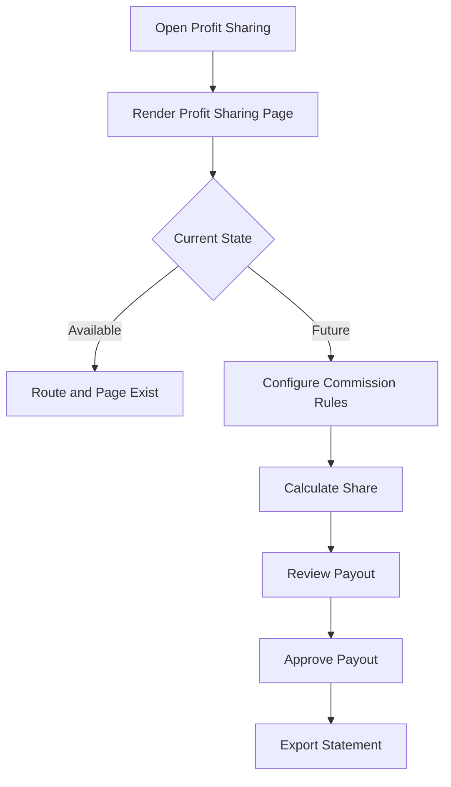

### Frontend Files

- `src/pages/ProfitSharingPage.tsx`
- `src/config/tenants/default.json`

### Implemented Functionality

- Route exists
- Sidebar item exists
- Permission mapping exists
- Tenant feature configuration exists

### Missing Frontend Functionality

- Commission rule UI
- Payout list UI
- Payout approval UI
- Doctor attribution UI
- Export statements UI
- Adjustment/dispute UI

### AI Opportunities

- Profit-sharing explanation assistant
- Anomaly indicator
- Forecasting widget

## 4.15 Shared UI Components

### Description

The app includes a reusable UI layer for buttons, dialogs, form controls, loading states, error states, tabs, select controls, popovers, dropdowns, cards, badges, and toast messages.

### User Flow

1. User navigates through the application shell.
2. Layout components render sidebar, header, mobile navigation, and page content.
3. Feature pages use shared UI components for forms, dialogs, buttons, cards, tables, loading states, errors, and toasts.
4. User actions open modals through the central modal registry.
5. Confirmation, loading, error, offline, and toast feedback are shown through shared UI primitives.

### Flow Diagram

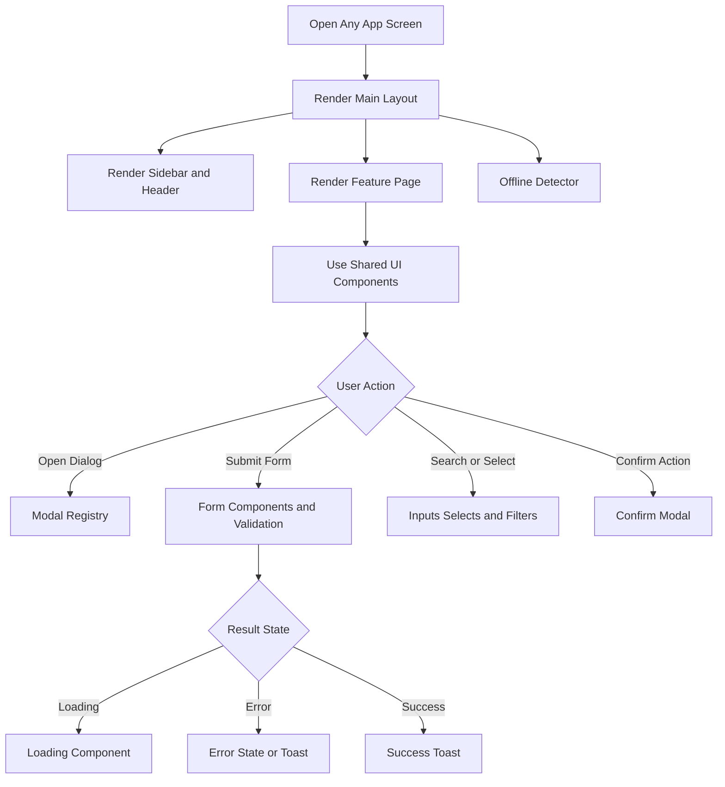

### Important Files

- `src/components/ui/Button.tsx`
- `src/components/ui/Dialog.tsx`
- `src/components/ui/Form.tsx`
- `src/components/ui/FormRenderer.tsx`
- `src/components/ui/Input.tsx`
- `src/components/ui/Textarea.tsx`
- `src/components/ui/Select.tsx`
- `src/components/ui/SearchableSelect.tsx`
- `src/components/ui/Tabs.tsx`
- `src/components/ui/Popover.tsx`
- `src/components/ui/DropdownMenu.tsx`
- `src/components/ui/Card.tsx`
- `src/components/ui/Badge.tsx`
- `src/components/ui/Checkbox.tsx`
- `src/components/ui/Tooltip.tsx`
- `src/components/ui/Toast.tsx`
- `src/components/ui/Loading.tsx`
- `src/components/ui/ErrorState.tsx`
- `src/components/ui/OfflineDetector.tsx`

### Implemented Functionality

- Reusable buttons
- Reusable dialogs
- Reusable form controls
- Dynamic form renderer
- Toast messages
- Loading UI
- Error state UI
- Offline detection
- Tabs
- Popovers
- Menus
- Badges
- Cards
- Tooltips

### Missing Frontend Functionality

- Global design token documentation
- Storybook
- Component visual tests
- Accessibility test coverage
- Dark mode component states

## 5. Frontend Security Review

### Implemented in Frontend

- Protected route checks
- Permission parsing
- Permission-based navigation
- Auth state storage utility
- Token refresh behavior in frontend client
- Logout clears stored auth data
- Tenant ID inclusion in frontend service client

### Frontend Risks and Gaps

- Demo login should be environment-gated.
- Permission maps are duplicated.
- Appointment permission has inconsistent spelling support.
- No MFA UI.
- No SSO UI.
- No session expiry warning UI.
- No user security settings page.
- No frontend audit-history screens.

### Recommendations

- High impact / Low effort: Gate demo mode with environment flag.
- High impact / Low effort: Centralize permission constants.
- Medium impact / Medium effort: Add account/security settings screens.
- Medium impact / Medium effort: Add session warning and re-auth prompt.

## 6. Frontend Performance Review

### Implemented

- TanStack Query caching
- Query invalidation
- Debounced search in multiple pages
- Vite build pipeline
- Component-level derived state

### Gaps

- Routes are not lazy loaded.
- Modal registry imports many feature components eagerly.
- Large list virtualization is not visible.
- Bundle analysis is not configured.
- Image optimization strategy is not visible.

### Recommendations

- High impact / Medium effort: Lazy load route pages.
- High impact / Medium effort: Split modal registry by feature.
- Medium impact / Medium effort: Add virtualization to large tables.
- Medium impact / Low effort: Add bundle analyzer.
- Medium impact / Medium effort: Add skeleton loading consistency.

## 7. Frontend Accessibility Review

### Implemented

- Semantic React components in many places
- Buttons and inputs use reusable primitives
- Some aria labels are present

### Gaps

- No automated accessibility tests
- Keyboard navigation needs full audit
- Color contrast should be verified for all themes/states
- Focus management in modals should be audited
- Table accessibility should be audited

### Recommendations

- High impact / Medium effort: Add accessibility smoke tests.
- Medium impact / Low effort: Audit contrast for all UI states.
- Medium impact / Medium effort: Add keyboard shortcut and focus management audit.

## 8. Frontend Developer Experience Review

### Strengths

- Feature-based component organization
- Domain-based hook folders
- Shared generic query/mutation hooks
- Central validation schemas
- Tenant configuration
- Reusable UI primitives

### Gaps

- Package name is still `vite-react-typescript-starter`.
- No test framework configured.
- No Storybook.
- No Prettier config.
- Some generated/comment text has encoding artifacts.
- `src/services/api.ts` appears to overlap with `src/services/apiClient.ts`.

### Recommendations

- High impact / Low effort: Rename package metadata.
- High impact / Medium effort: Add Vitest and React Testing Library.
- Medium impact / Medium effort: Add Playwright smoke tests.
- Medium impact / Medium effort: Add Storybook.
- Medium impact / Low effort: Remove or clearly mark legacy service utility.
- Medium impact / Low effort: Add Prettier.

## 9. Dependency Review

### Major Runtime Dependencies

- `react`
- `react-dom`
- `react-router-dom`
- `@tanstack/react-query`
- `axios`
- `react-hook-form`
- `zod`
- `@hookform/resolvers`
- `tailwindcss`
- `lucide-react`
- `framer-motion`
- `motion`
- `jspdf`
- `html2canvas`
- `xlsx`
- `react-signature-canvas`
- `qrcode`
- `js-cookie`
- `class-variance-authority`
- `clsx`
- `tailwind-merge`

### Development Dependencies

- `vite`
- `typescript`
- `eslint`
- `typescript-eslint`
- `@vitejs/plugin-react`
- `eslint-plugin-react-hooks`
- `eslint-plugin-react-refresh`
- `autoprefixer`
- `postcss`

### Possible Cleanup Items

- `framer-motion` and `motion` may overlap.
- `@types/react-router-dom` is v5 while `react-router-dom` is v7.
- `shadcn` may not be needed as runtime dependency.
- Tailwind package versions should be reviewed for v3/v4 mismatch.

## 10. Frontend Roadmap

### High Priority

- Centralize permission constants.
- Gate demo login by environment.
- Add route-level lazy loading.
- Split modal registry imports.
- Add test framework.
- Add patient duplicate merge UI.
- Add appointment conflict warning UI.
- Add consultation autosave indicator.
- Add consistent loading and error states.

### Medium Priority

- Add Storybook.
- Add report filters and exports.
- Add advanced patient filters.
- Add low-stock/expiry alert screen.
- Add role/permission management screen.
- Add consent templates.
- Add EMR templates.
- Add treatment templates.
- Add dashboard date/doctor filters.

### Low Priority

- Dark mode.
- Command palette.
- Keyboard shortcuts.
- Breadcrumbs.
- Recently viewed records.
- User dashboard personalization.

## 11. AI Frontend Opportunities

- Global clinic assistant
- Patient summary panel
- EMR summary panel
- Natural-language patient search
- Natural-language report questions
- Appointment slot suggestion UI
- No-show risk indicator
- Treatment recommendation assistant
- Consent explanation assistant
- Billing anomaly indicator
- Inventory reorder suggestion widget
- Staff schedule optimization suggestions
- Membership eligibility assistant

## 12. Mermaid Mind Map

```mermaid
%%{init: {
  "theme": "base",
  "themeVariables": {
    "primaryColor": "#ffffff",
    "primaryTextColor": "#111827",
    "primaryBorderColor": "#9ca3af",
    "lineColor": "#6b7280",
    "secondaryColor": "#f3f4f6",
    "tertiaryColor": "#e5e7eb"
  }
}}%%
mindmap
  root((Opal Smiles Dental Clinic Portal Frontend))
    Tech Stack
      React
      TypeScript
      Vite
      Tailwind CSS
      TanStack Query
      Axios Client Utility
      React Router
      Zod
      React Hook Form
      Lucide Icons
      jsPDF
      XLSX
      Signature Canvas
    App Shell
      Providers
        TenantProvider
        AuthProvider
        AppProvider
        ModalProvider
      Routing
        Login
        Protected Routes
        Permission Guards
      Layout
        Sidebar
        Header
        Mobile Nav
        Global Search
        Modal Registry
      State
        Context
        TanStack Query
        Local State
    Authentication
      Pages
        Login
        Forgot Password Views
      Components
        Login Form
      Existing
        Protected Routes
        Permission Sidebar
        Demo Login
        Logout
      Missing
        MFA UI
        SSO UI
        Session Warning
        Security Settings
    Dashboard
      Components
        Stats
        Today Appointments
        Recent Patients
        Smart Alerts
        Doctor Performance
      Existing
        Greeting
        KPI Cards
        Quick Add Patient
      Missing
        Custom Widgets
        Date Filters
        Exports
      AI
        Daily Summary
        Smart Insights
    Appointments
      Pages
        Calendar View
        List View
      Components
        Appointment Form
        Doctor Booking
        Timeline
        Booking Slots
      Existing
        Create
        Edit
        Delete
        Check In
        No Show
        Filters
      Missing
        Recurring UI
        Waitlist UI
        Reminder UI
        Conflict Warnings
      AI
        Slot Suggestions
        No Show Risk
    Patients
      Components
        Patient List
        Patient Form
        Patient Details
        Filters
        Stats
      Existing
        Multi Step Form
        Medical History
        Documents Display
        Export
        Corporate Link
      Missing
        Duplicate Merge
        Portal UI
        Activity Timeline
        Attachment Manager
      AI
        Patient Summary
        OCR
        Smart Search
    Consultation
      Components
        Queue
        Tooth Chart
        Prescriptions
        Treatment Planning
        Clinical Images
        Follow Up
      Existing
        Patient Queue
        Direct Consultation
        Clinical Notes
        Draft State
      Missing
        Autosave Indicator
        Templates
        Encounter Lock UI
      AI
        Note Summary
        Treatment Suggestions
    Treatments
      Components
        Treatment List
        Treatment Form
        Viewer
        Session Manager
      Existing
        Plans
        Sessions
        Prescriptions
        Images
        Status
      Missing
        Templates
        Version History
        Estimate Preview
      AI
        Plan Recommendation
    Billing
      Components
        Invoice List
        Invoice Form
        Invoice Viewer
        Payment Modal
        Payment History
      Existing
        Invoices
        Pending Items
        Plan Banner
        Complimentary Notes
      Missing
        Refund UI
        Credit Note UI
        Receipt Template
        Export
      AI
        Billing Anomaly
    EMR
      Components
        EMR List
        EMR Form
        EMR Viewer
      Existing
        Search
        Type Filter
        Timeline
        Attachments Display
      Missing
        Edit
        Delete
        Version History
        Signing UI
      AI
        EMR Summary
        Semantic Search
    Consent
      Components
        Consent List
        Consent Form
        Signature Pad
        Viewer
      Existing
        Digital Signature
        Risk Fields
        Offline Image Display
      Missing
        Templates
        Multilingual UI
        PDF Preview
        Doctor Signature
      AI
        Consent Explanation
    Inventory
      Components
        Inventory List
        Item Form
        Restock
        Consume
        Adjust
        History
      Existing
        Stock List
        Categories
        Movements
        Low Stock Support
      Missing
        Barcode UI
        Purchase Orders
        Expiry Alerts
      AI
        Reorder Suggestions
    Staff
      Components
        Doctor Management
        Doctor Form
        Schedule Manager
        Salary Modals
      Existing
        Search
        Role Filter
        Schedule
        Salary
      Missing
        Attendance
        Leave
        Permission Editor
      AI
        Schedule Optimization
    Membership
      Components
        Plan Management
        Employee Management
        Bulk Import
        Quick Registration
      Existing
        Plans
        Members
        Dependents
        Plan Change
      Missing
        Benefit Usage
        Renewals
        Member Cards
      AI
        Eligibility Assistant
    Reports
      Components
        Reports Dashboard
      Existing
        Analytics UI
        Mock Analytics
      Missing
        Filters
        Exports
        Report Builder
      AI
        Natural Language Analytics
    Profit Sharing
      Existing
        Route
        Tenant Config
      Missing
        Commission UI
        Payout UI
        Approval UI
      AI
        Attribution Insights
```
